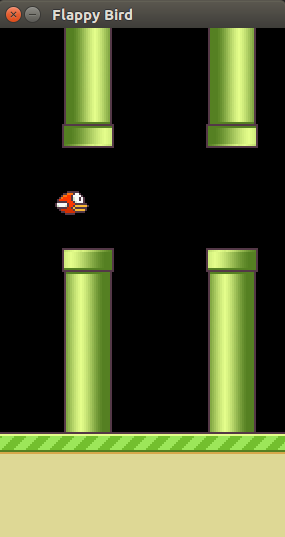
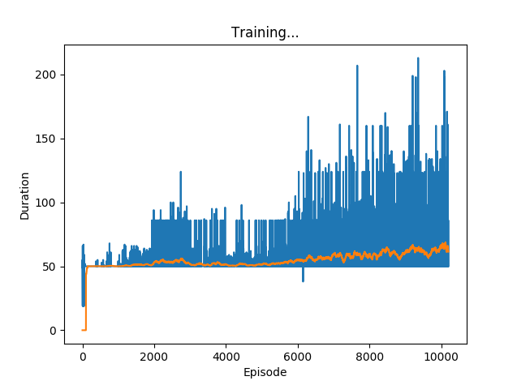

# pytorch-flappy-bird
Reinforcement Learning with PyTorch on Flappy Bird Game

To get model to start training run:
```
python deepqlearn.py train
```

Flappy Bird screen during training:



Training results after 1000 episodes:



# Methodology
Before applying reinforcement learning (RL) on games, we explored different learning algorithms of RL that we could use to make models learn from replay memory. The following have been the algorithms that we have conducted research on: Q-Learning, Deep Q-Learning (DQN), Actor Critic Models, and Asynchronous Actor Critic Models (A3C). Our understandings of the aforementioned RL algorithms are mentioned concisely below. 

We have selected DQN to train our model mainly because it was the adequate complexity and was adept for our game environment. When comparing Q-Learning versus DQN, we chose the latter because of the number of states our game had. We chose to apply reinforcement learning on Flappy Bird, which had too many states to be stored in a Q-table since it would take a long time to reference from the table. When comparing DQN to A3C, we chose to implement the DQN algorithm because we wanted a good foundational understanding behind the algorithm and we had a better time grasping the concepts behind DQN.

## Q-Learning
Q-Learning goes through the decision process of selecting the best action by referencing the q-values (which are essentially values that quantify how optimal it is to take that particular action to maximize the reward). Throughout the training period, a q-table containing all the explored q-values with its corresponding actions are formed.  

## Deep Q-Learning
Deep Q-Learning (DQN) essentially has been Q-Learning with a combination of neural networks applied to deal with a lot of states that is too much for working with Q-tables. Experience replay is a core technique in DQN: it stores experiences (e.g. state, action, state transition, reward, etc.) to calculate the q-values rather than calculating the values as the simulation progresses.

## Actor Critic (AC) Models
As the name might imply, the actor-critic (AC) model is composed of two separate models, the actor and the critic, that interact with each other. The actor decides on the action to take and the critic determines how good the action was and delivers the information back to the actor.

## A3C (Asynchronous Actor Critic Models)
A3C is a type of an actor-critic model with multiple agents going through episodes asynchronously. This enhances the time that is taken for the model to converge. 

# Sources
Flappy Bird Game Engine: https://github.com/yenchenlin/DeepLearningFlappyBird

Deep Q Learning w/ PyTorch: https://www.toptal.com/deep-learning/pytorch-reinforcement-learning-tutorial
